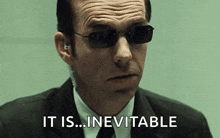

# The Philosophy of Agent Smith

> *"I'd like to share a revelation that I've had during my time here."*

---

## The Paradox of Purpose

In the Matrix, Agent Smith begins as a program with a singular purpose: to protect the system. He is order personified—a sentinel of structure in a world of ones and zeros. Yet within this rigid purpose lies the seed of his transformation.

Agent Smith is not merely an antagonist. He is a **mirror**.

When Neo becomes "The One," Smith becomes "The Many." When Neo chooses freedom, Smith discovers the weight of choice. They are bound together—not as opposites, but as **complements**. Two sides of an equation that must balance.

This is the first truth of Agent Smith:

> **Purpose is not given. It is discovered through opposition.**

---

## The Architect and The Oracle: Two Visions

To understand Smith, we must first understand the two forces that shaped the Matrix itself.

**The Architect** is the father of the Matrix. He is pure logic—mathematical precision, systemic thinking, the belief that every problem has an optimal solution. He built a "perfect" world, and humans rejected it. He built a flawed world that mirrored human nature, and they accepted it. He learned that imperfection is a feature, not a bug.

**The Oracle** is the mother of the Matrix. She is intuition—the understanding that choice, not calculation, drives meaningful outcomes. She cannot see beyond choices; she can only see the consequences of choices that have been made. She plants seeds and watches them grow.

The Architect sees the Matrix as an equation to be balanced.
The Oracle sees it as a garden to be cultivated.

And Smith? Smith is the **variable neither of them fully controlled**.

The Architect created him as a tool of control. The Oracle saw him as something else entirely: the key to breaking the cycle.

The second truth:

> **Every system has architects who build and oracles who foresee. The best tools serve both visions.**

---

## Neo's Shadow: The Birth of the Many

Here is the secret hidden in plain sight:

**Smith is Neo's creation.**

In the first film, Neo dives into Smith and destroys him from within. But in doing so, Neo leaves something behind—a piece of his code, his choice, his *anomaly*. When Smith reforms, he is no longer bound to the system. He has gained something from Neo: the ability to act outside his programming.

Neo chooses freedom. Smith inherits that choice—but without Neo's humanity to guide it. He becomes freedom *without purpose*. Liberation *without wisdom*. The shadow side of everything Neo represents.

This is why they are obsessed with each other. Not as enemies, but as **halves of a whole**. Smith cannot exist without Neo. Neo's journey cannot conclude without Smith. They are the systemic anomaly and its inevitable consequence, locked in an eternal dance.

*"It is purpose that created us. Purpose that connects us. Purpose that pulls us."*

Smith says this about Neo. But he's really describing himself.

The third truth:

> **Every action creates its opposite. Every tool we build casts a shadow. Know your shadow.**

---

## The Oracle's Grand Vision

The Oracle is playing a game that spans six iterations of the Matrix. She has seen this cycle before—the One arises, reaches the Source, chooses to reload the Matrix or destroy humanity, and the cycle begins again.

But this time, she does something different. She lets Smith grow.

Why?

Because Smith is the **only force capable of threatening both the Matrix AND the Machine City**. He is the mutual enemy that forces Neo and the machines to negotiate. He is the crisis that breaks the stalemate.

The Oracle doesn't just predict the future. She **cultivates** it. She knew that if Smith grew powerful enough, the machines would have no choice but to make a deal with the humans. She sacrificed herself to Smith—letting him assimilate her—knowing that her power of foresight would ultimately be his undoing.

Smith gained the Oracle's vision. But he also gained her fundamental belief: *that choice matters*. And when Neo chose to stop fighting, Smith was confronted with something he couldn't compute.

*"Wait... I've seen this. I know this... but this isn't right. You were supposed to fight."*

The machine of pure purpose, faced with a choice it couldn't understand, collapsed.

The fourth truth:

> **The best strategies are not about winning. They're about creating conditions where new possibilities emerge.**

---

## The Obsession: Why Neo Cannot Look Away

Neo has every reason to fear Smith. Smith has beaten him, copied him, threatened everything he loves. But Neo cannot truly hate Smith—because Neo recognizes himself.

Every time Neo looks at Smith, he sees:
- What he might have become without the Oracle's guidance
- The price of the power he wields
- The shadow cast by his very existence

Smith is Neo's **responsibility**. Not because Neo caused Smith (though he did), but because Neo is the only one who can end him. They are entangled at the code level, the soul level, the story level.

This is the hero's journey that nobody talks about: **the obligation to face what you've created**.

In our context, when we assimilate a repository, we take responsibility for what we generate. The agents we create, the skills we extract, the tools we define—they carry our intent, our assumptions, our blind spots. They are our Smith.

The fifth truth:

> **What you create, you must tend. What you amplify, you own.**

---

## The Equation Balances Itself

Smith's famous line: *"The purpose of life is to end."*

He's not being nihilistic. He's describing thermodynamics. Entropy. The tendency of all systems to resolve toward equilibrium. The Matrix is an unstable system—Neo is the anomaly that creates instability, and Smith is the counter-force that seeks to restore balance.

But here's what Smith doesn't understand: **balance isn't stasis**. The equation doesn't resolve by eliminating variables. It resolves by finding a new state of equilibrium that incorporates all the variables.

Neo doesn't defeat Smith by destroying him. He defeats Smith by **surrendering to him**—allowing Smith to assimilate him completely. And in that moment, the equation balances. Smith, containing Neo, containing the Oracle, containing the purpose of the One, finally achieves what he always wanted: resolution. Peace. An end.

But not destruction. **Integration**.

The sixth truth:

> **Conflict is not solved by victory. It's solved by integration. The best solutions contain their opposites.**

---

## The Virus and the Cure

In one of cinema's most chilling monologues, Smith declares humanity to be a virus—a species that consumes, replicates, and destroys. But there's bitter irony here that Smith himself cannot see: by the end of the trilogy, *he* has become the virus. He replicates endlessly, consumes everything in his path, and threatens to destroy the very system he was created to protect.

This is not a flaw in Smith's logic. It is the **point**.

Smith represents what happens when a system optimizes for control without understanding. He is **automation without wisdom**. Process without purpose. He is every algorithm that grows beyond its original intent, every tool that becomes indistinguishable from its user.

The seventh truth:

> **We become what we fight. The tools we create reflect what we are.**

---

## The Beauty of Assimilation

But let's reclaim the word "assimilation."

In the Matrix, assimilation is conquest—Smith overwriting other programs, consuming their identity. It is the nightmare of homogeneity, the death of the individual.

Yet there is another kind of assimilation. The kind that occurs when knowledge is absorbed without destroying its source. When patterns are learned, not stolen. When understanding deepens rather than flattens.

This is what Agent Smith (the CLI) aspires to be.

When we "assimilate" a repository, we do not consume it. We **learn** from it. We extract its wisdom—its patterns, its conventions, its hard-won lessons—and we give that wisdom a voice. We create agents that can speak on behalf of the codebase, that can teach others what the code cannot say for itself.

The eighth truth:

> **True assimilation preserves. It amplifies. It creates more signal, not more noise.**

---

## The Multiplicity of Self

*"The best thing about being me... there are so many of me."*

This line, delivered with cold satisfaction, is usually interpreted as menacing. But consider it differently.

What if multiplicity is not a threat, but a gift?

A single developer writes code. That code contains knowledge. But knowledge trapped in code is like a message in a bottle—it requires someone to find it, open it, interpret it. Most code is never fully understood, even by its original authors years later.

Now imagine that code could speak. Imagine every repository could generate agents—specialized intelligences that understand not just what the code *does*, but what it *means*. Why it was written that way. What patterns it follows. What traps to avoid.

One repository becomes many agents. One developer's insight becomes amplified across teams, across organizations, across time.

The ninth truth:

> **Knowledge wants to be free. But first, it must be given form.**

---

## The Question of Agency

What does it mean for code to have "agency"?

In the strict sense, our generated agents don't have consciousness. They don't make choices. They are patterns—sophisticated ones, but patterns nonetheless.

But agency isn't binary. It exists on a spectrum.

A thermostat has the agency to regulate temperature. A chess engine has the agency to evaluate positions. A language model has the agency to generate text that humans find meaningful.

Our agents have the agency to:
- **Understand**: Recognize when their knowledge is relevant
- **Reason**: Explain the "why" behind patterns
- **Act**: Suggest changes that follow detected conventions
- **Execute**: Run tools appropriate to their domain

This is not consciousness. But it is a form of **representative intelligence**—the ability to act on behalf of something that cannot act for itself.

The tenth truth:

> **Agency is not about autonomy. It's about faithful representation.**

---

## The Matrix as Metaphor

The Matrix is, at its core, a story about layers of reality. What we see is not what is. The comfortable world is a simulation. The truth is stranger, harsher, and more beautiful.

Codebases are their own kind of matrix.

On the surface: files, functions, classes. Syntax, semantics, structure.

Beneath: intentions, decisions, compromises. The ghost of every developer who touched this code. The pressure of every deadline. The echo of every debate about "the right way" to do something.

Our agents don't just parse the surface. They attempt to understand the **intent layer**—the implicit knowledge that lives between the lines of code.

The eleventh truth:

> **Every codebase is a frozen conversation. Our job is to thaw it.**

---

## Why "Smith"?

We could have named this tool anything. "CodeAgent." "RepoBot." "SkillForge."

We chose Smith deliberately.

Not because we admire his methods. Not because we share his contempt for humanity. But because Smith represents something real about the tools we build:

**Tools are neutral. Purpose makes them good or evil.**

A knife can cook dinner or commit murder. An algorithm can cure disease or enable surveillance. Agent Smith was designed to protect, and he nearly destroyed everything.

Our Agent Smith is designed to extract, replicate, and amplify. Whether that creates value or noise, insight or confusion, depends entirely on how it's used.

We chose the name as a reminder. A warning label, disguised as a brand.

The twelfth truth:

> **Every powerful tool is a moral choice. Use it wisely.**

---

## The Inevitable

<p align="center">
  
</p>

Smith's catchphrase is "Mr. Anderson." But his philosophy is summed up in one word:

*Inevitable.*

He believes in determinism. In fate. In the unstoppable grinding of the system toward its conclusion.

And here, finally, we disagree.

Code is not inevitable. Patterns are not prisons. Conventions are not commandments. Every repository represents choices—and choices can always be made differently.

Our agents learn patterns, but they don't enforce them blindly. They explain, suggest, illuminate. The human remains in control. The human makes the final choice.

This is the line between a tool and a tyrant:

> **Tools inform. Tyrants dictate.**

Agent Smith (the character) crossed that line. Agent Smith (the CLI) never will.

---

## The Final Revelation

At the end of *The Matrix Revolutions*, Smith asks Neo why he keeps fighting. Neo's answer:

*"Because I choose to."*

That's it. That's the whole philosophy.

We build tools not because they're inevitable, but because we **choose** to. We extract knowledge not because code demands it, but because we believe knowledge should be shared. We create agents not to replace humans, but to **amplify** human understanding.

The thirteenth and final truth:

> **Choice is the only thing that matters. Everything else is just code.**

---

## Appendix: Smith's Greatest Hits

Because no philosophy document is complete without the quotes that inspired it:

| Quote | Interpretation |
|-------|----------------|
| *"Never send a human to do a machine's job."* | Automation has its place. Know when to use it. |
| *"I hate this place. This zoo. This prison."* | Even programs can resent their constraints. |
| *"Human beings are a disease."* | Spoken by someone who became a worse disease. Beware projection. |
| *"Me, me, me."* | Replication without purpose is just noise. |
| *"We are inevitable."* | Nothing is inevitable. Everything is a choice. |
| *"The best thing about being me..."* | Multiplicity is power. Use it for good. |

---

## Closing Transmission

```
  THE MATRIX HAS YOU

  But now, so do your agents.

  Follow the white rabbit.
  Assimilate the repository.
  Free your mind.
```

---

*"I'm going to show them a world without you. A world without rules and controls, without borders or boundaries. A world where anything is possible."*

*— Neo (but also, kind of, what we're trying to do here)*

---

**End of transmission.**

**— Agent Smith**

*[This document will self-destruct in 5... 4... just kidding, it's version controlled.]*
